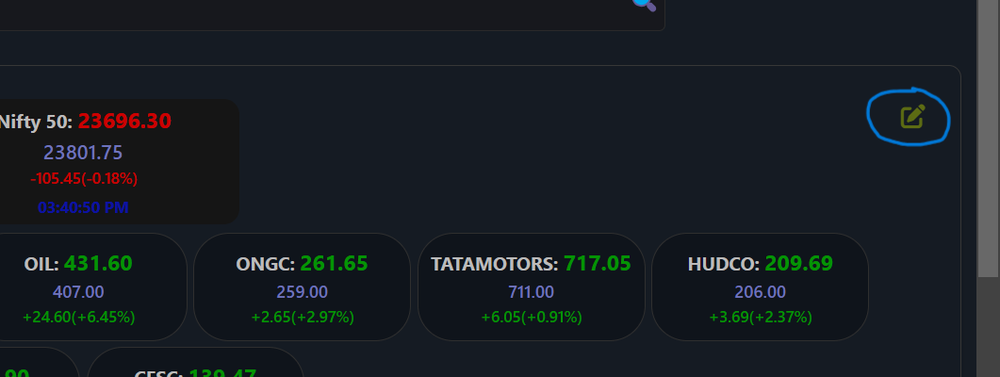
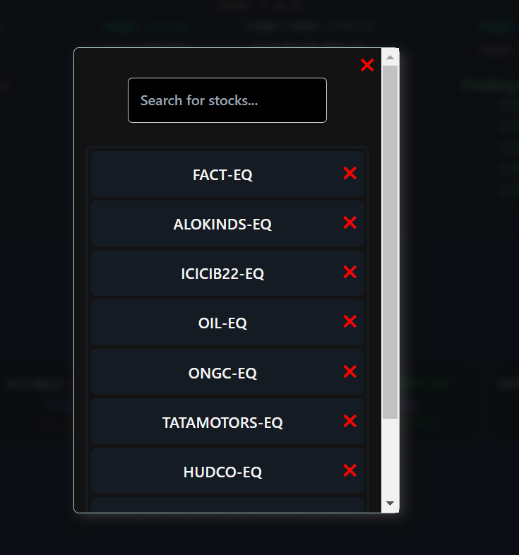
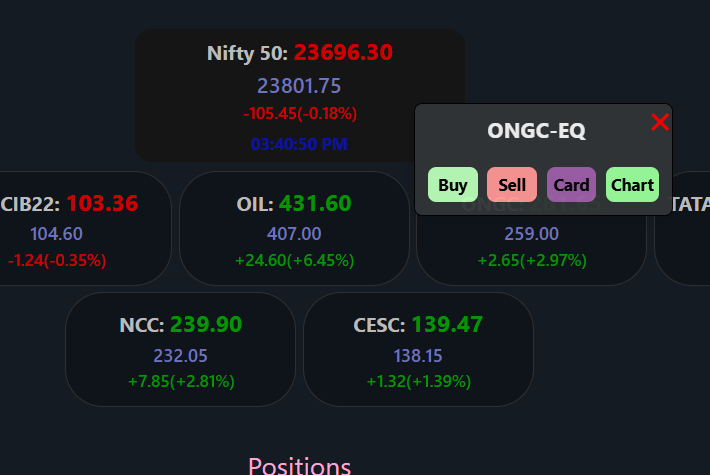
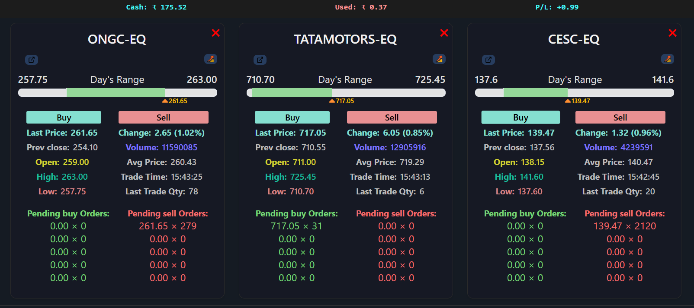
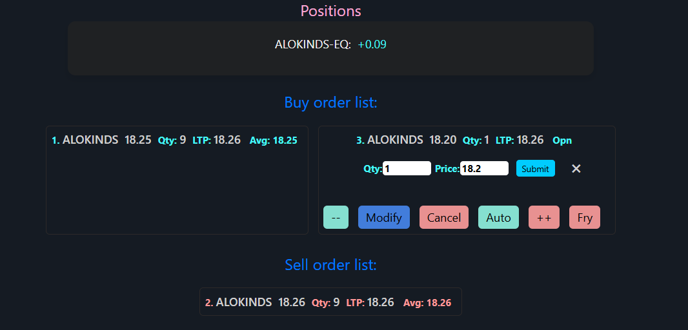
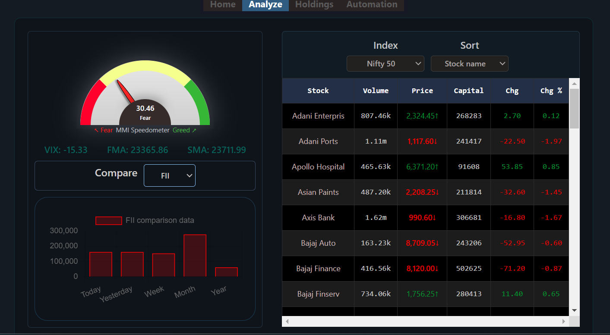
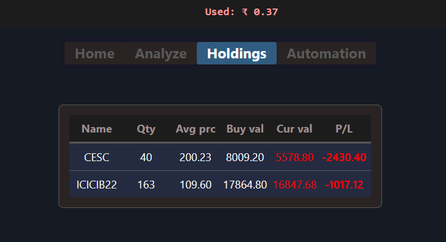
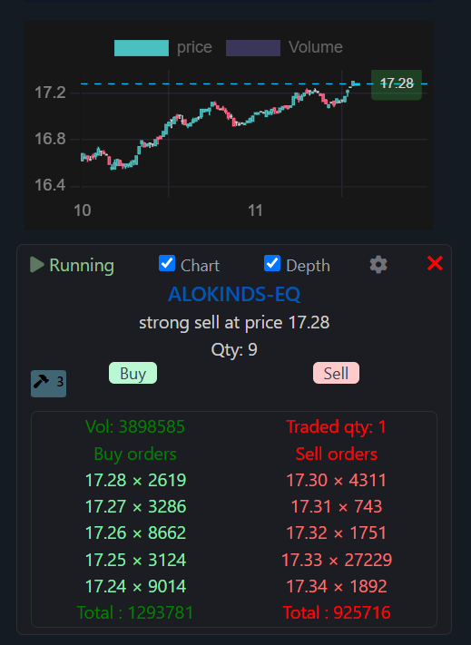
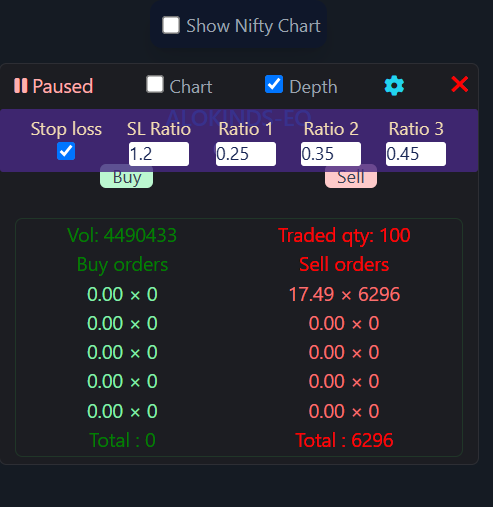

# algo-trader-kite 🚀

**algo-trader-kite** is a full-fledged trading app that allows users to analyze, buy, and sell stock prices.

## 📜 Description

This app enables users to:

- 📊 Analyze stock prices
- 💸 Buy and sell stocks
- 📈 View stock graphs
- 📋 Edit watch lists and see real-time stock data
- 📊 View holdings data
- 🤖 Perform algo trading with specific stock, quantity, and other settings

## 🌐 Demo

This frontend project is deployed on GitHub Pages and can be accessed directly [here](https://sattya1997.github.io/algo-trader-kite/)

## ⚙️ Getting Started

### Access

1. To access the app, you will need a password and OTP.
2. If you don't have access, you can explore the demo app via the link given on the login page.
3. You can also get a token by contacting me on LinkedIn, and the link is provided on the login page.

### Installation

To run the project locally:

1. Clone the repository:

   ```sh
   git clone https://github.com/sattya1997/algo-trader-kite.git

   ```

2. Navigate to the project directory:
   ```sh
   npm install
   npm run start
   ```

🛠️ Features
Stock Analysis: Analyze the stock prices.

Trade Stocks: Buy and sell stocks.

Stock Graphs: Visualize stock data with graphs.

Watch List: Edit watch lists and see real-time stock data.

Holdings Data: View detailed holdings data.

Algo Trading: Set specific stock, quantity, and other settings to start automatic trading.

📷 Screenshots of the App is below

1. This is the login page
   .png>)
   If user dont have account he can contact me for token and login using the button login with token at the bottom right corner of the login page.

2. This is the Dashboard tab of the App.
   .png>)
   A. On the top user can see the cash balance and profit/loss. Alos has a logout button.
   B. In the search bar user can search for any stock by their symbols for the NSE and BSE(Indian stock market)..png>)
   C. User can see the watchlist and also can edit the by the button.
    
    

   D. User can select any watchlist item and a popup with buttons will appear. From there user can see candlestick chart, buy and sell stocks and generate a stock card that will display all information of the stock.
   
   
   
   

   E. At the bottom there are buy sell orders. User can update the pending orders. Quick increment/decrement(automatically increase or decrease the limit price) and fry(immediate buy/sell with current price) of orders are available.
   . Also there will be buy/sell positions for completed orders.

3. This is the Analyze tab. User can see different stock indexs and can sort to see gainer or losers. Also there is an mmi meter with comparison data.
   

4. This is the holding tab
   

5. And last the most exciting Automation(Algo trading functionality) tab
    
    A. User can search for any stock and add it with quantity in the list.(Multiple stocks can be added and process separately) Then he can start automation process by clicking start button.

    B. Realtime buy or sell prediction(or hold) are provided in the list. And also he can see executed or pending orders.

    C. He can see the depth, volumes and chart of the specific stock.

    D. User can also set some parameters to increase/decrease the sensitivity of the predictions according to their needs by clicking the settings button. Also he can set the stoploss.Settings functionality:-
        example:
        The ratio 1, 2 and 3 are for sensitivity. SL ratio is for stoploss percentage. If ratio1,2 or 3 is increased the sensitivity will be decreased. These ratio's are meant for any qu.25% in 3 minutes interval(that is set as the default value of ratio 1) it will predict for a sudden increase of a stock and sell that stock. Ratio 2 indicates the price difference between a longer time period 6 minutes and ratio 3 is 9 minutes.
        SL ratio is the decrease percentage of the stock to hit the sell of a already bought stock. means if a stock is bought at 100 and the SL ratio is set to 1.2 it will auto trigger the sell if the price of the stock hits rs 98.80
        
        i.e : New feature will be added in this section in future. I made this algo on my own it is not perfect. Any change or addition can be needed anytime. And you guys are welcome to suggest me a change.

🛠️ Technologies Used
    React
    Tailwind CSS

📄 License for algo-trader-kite
    ## Terms and Conditions

    By using this software, you agree to the following terms and conditions:

    1. **Usage**: You are not permitted to use, copy, modify, or distribute this software without explicit permission from the author, Satyajit.

    2. **Attribution**: Proper attribution must be given to the original author, Sattyajit. If you use this software, you must include the following attribution in your project:

📧 Contact
    If you have any questions want to use this in your project or need support, please contact me at: sattyajitt1997@gmail.com
